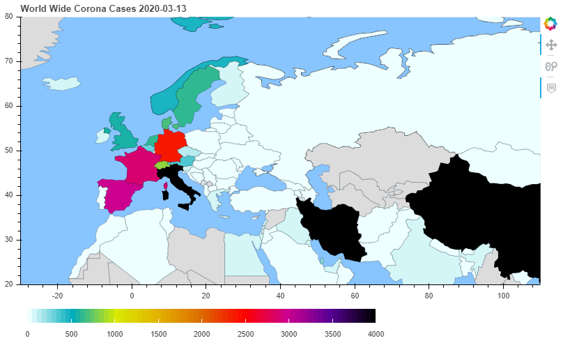

# Covid-19-Visualization
Visualizing Corona Virus Data on a global map using Python with Geopandas and Bokeh.

---

---

Data Source: http://cowid.netlify.com/data/full_data.csv

( https://ourworldindata.org/coronavirus-source-data )

World Shape Source: https://www.naturalearthdata.com/downloads/110m-cultural-vectors/

---

### imports
- urllib
- json
- numpy
- matplotlib
- pandas
- geopandas
- bokeh
- statsmodels

---

### usage

- box[2] - define custom color gradient
- box[3] - download most recent dataset
- box[6] - define 'h' as a top border for cases (black color, default 4000)
- box[8] - choose for how many days back you want to see data (default 7, 'all' option can be slow)
- hover over region to see data in numbers
- drag and zoom to see more regions
- box[10] - use for (not so great) future prediction

