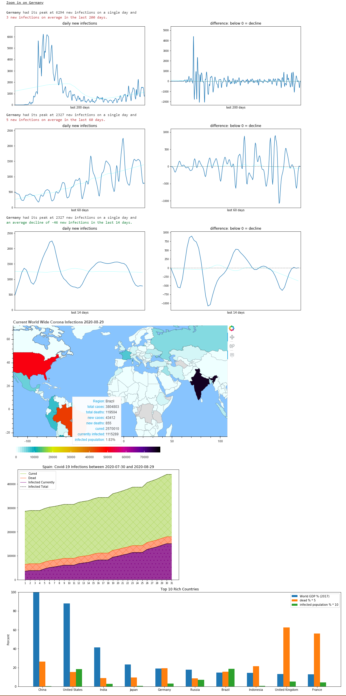

# Covid-19-Visualization
Visualizing Corona Virus Data on a global map using Python with Geopandas and Bokeh.

---

---

Data Source: https://ourworldindata.org/coronavirus-source-data

World Shape Source: https://www.naturalearthdata.com/downloads/110m-cultural-vectors/

---

### imports
- urllib
- json
- numpy
- matplotlib
- pandas
- geopandas
- bokeh

---

### usage

see comments in notebook

